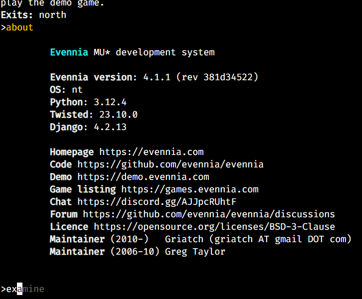

## xtermia, an xterm.js webclient for Evennia
This replaces the webclient of an [Evennia](https://github.com/evennia/evennia/tree/main) game with the [xterm.js](https://github.com/xtermjs/xterm.js) terminal emulator.
This is a demo that you can copy over a freshly initialized Evennia game.

### Features
- No more input box, type directly into the terminal like it's 1984
- Does terminal stuff
- Optional persistent map display
    - send 'map' command to webclient with your map to update the cached map
    - map will be centered in right half of terminal
	- map can be enabled/disabled/updated at will
    - (see [examples.py](commands/examples.py))
- Up/down arrow to scroll through command history
- Start typing to see completion suggestions, use right arrow or Tab to accept the suggestion
- You can hold Enter to spam commands now or type anything else to overwrite last command
- Ctrl+C to copy, Ctrl+V to paste in addition to the right-click copy/paste
- Clickable web links
- Completion suggestions based on Evennia commands available at login
- Tells Evennia the terminal width/height at startup and on resize
- Won't echo commands or add to command history until after login (won't echo password)
- Sound/music (see [examples.py](commands/examples.py))
- Interactive terminal mode (see [examples.py](commands/examples.py)) for an example, or type 'interact' in the game
- All files are local, no internet required
- Uses [Fira Code](https://github.com/tonsky/FiraCode) font because it has great box drawing characters

### Todo
- Shift + arrow key selection
- Save history to file
- Persist command history?

### Installation for a fresh game
Copy this repo's entire folder structure to your Evennia "mygame" game folder.
NOTE: 
- `/server/conf/settings.py` ***Will be overwritten***
- `/server/conf/inputfuncs.py` ***Will be overwritten***
- `/typeclasses/characters.py` ***Will be overwritten***
- `/commands/default_cmdsets.py` ***Will be overwritten***

### Installation for an existing game
Back up your existing game folder.
Copy this repo's entire folder structure to your Evennia "mygame" game folder,
except for the 4 files listed above.  If you haven't modified your inputfuncs.py, then
overwrite it with this one, otherwise merge this one with yours.

Add the settings from this settings.py to your existing settings.py.

Look at characters.py for command completion and map example, add what you want to yours.

### File sources
- Uses "CACHE BUSTERRRR" from https://github.com/InspectorCaracal/evelite-client/tree/main
- addon-fit.js = npm install @xterm/addon-fit
- addon-unicode11.js = npm install @xterm/addon-unicode11
- addon-webgl.js = npm install @xterm/addon-webgl
- FiraCode-VariableFont_wght.ttf = https://github.com/tonsky/FiraCode/releases/download/6.2/Fira_Code_v6.2.zip
- webclient.py = https://github.com/evennia/evennia/blob/main/evennia/server/portal/webclient.py
- xterm.css = npm install @xterm/xterm
- xterm.js = ""